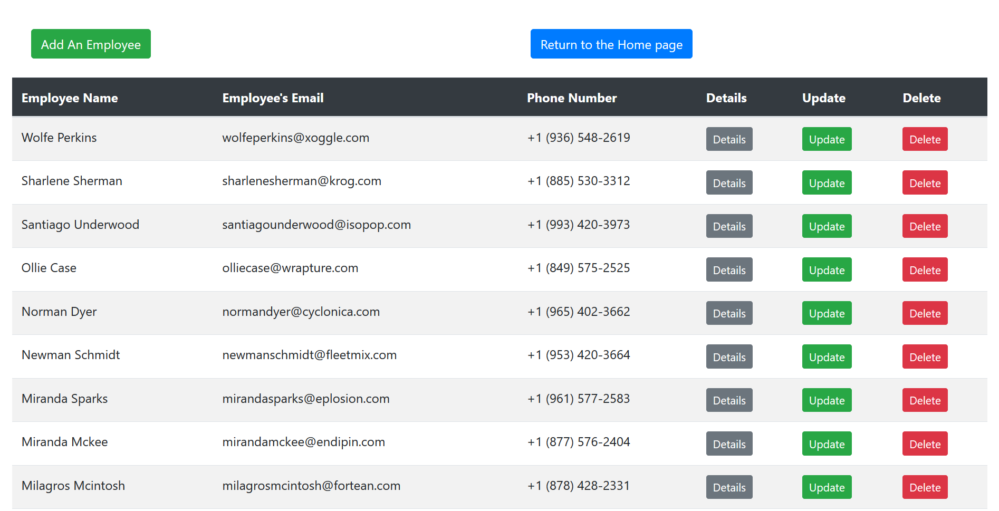
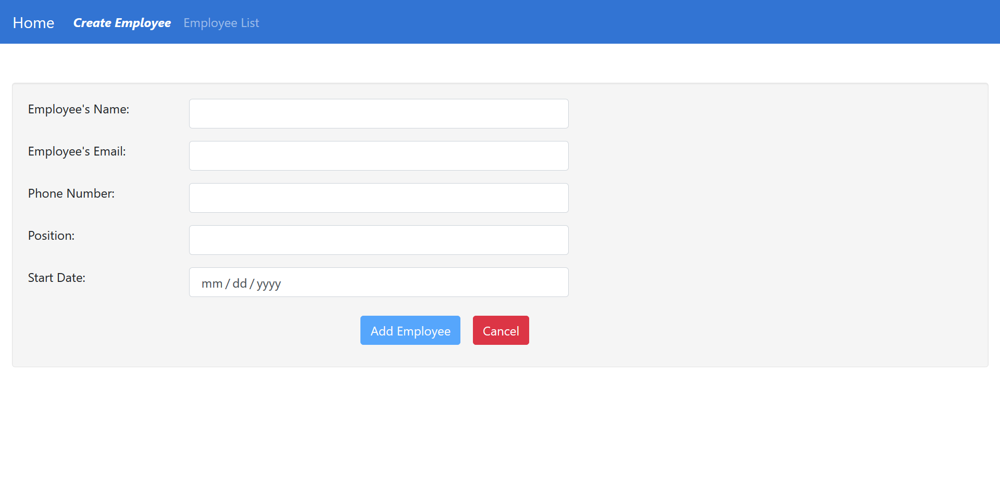
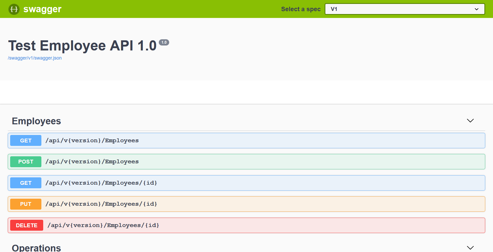

# Employee Manager

> A management system using Angular version 8 for front end UI and Asp.Net Core for a back end web Api.

## Scope

This is a project to demonstrate extending concepts into larger projects. It is an employee management system with form validation using Angular and ASP.Net Core. The concepts is to familiarize and combine a popular JavaScript framework with C#/ASP.Net Core, while providing Api Versioning, Controller End-point testing, and setup integration tests for future feature implementations.

The use of Data transfer objects (Dtos) using [Auto Mapper](https://automapper.org/) protects and maps the original entity classes found in the `Data\Entities` directory of the Api to classes for specific tasks, i.e. fetch, create, and edit.





## Demo

See a demo of the application running on Azure here: [Employee Manager on Azure](http://empmanagercore.azurewebsites.net) Or [TinyUrl](https://tinyurl.com/r8hpe5e).

## Development Stack

The application was built using the following tools & frameworks:

- C#/ASP.Net Core 2.2
- Angular version 8.3
- Bootstrap 4
- SQL Server or PostgreSQL Database (easily configured in DbContext class)

## Built-in Endpoint Testing

The project contains built in Api endpoint testing using [Swagger](https://github.com/domaindrivendev/Swashbuckle.AspNetCore). This was setup in the `Startup.cs`class in both the Configure services and IConfiguration to be used upon startup.
After launching the project in a local environment, navigate to `https://localhost:5001/swagger` to view the test index page.



## Setup

In order to test/use this application, you will need the following:

- Asp.Net Core 2.0 SDK, preferably 2.2.1
- Node.js version 8 or higher
- The Angular CLI
- Microsoft SQL Server or pgAdmin for PostgreSQL

## Installation

Grab the repository either by downloading the zip file or clone the project:

```sh
~$ git clone https://github.com/johnmcraig/employee-manager
```

After cloning or unzipping the files, navigate to the directory containing the solution file:

```sh
~$ cd src/EmployeeManager/
```

In either order, navigate to the client or api/server side files and install their dependencies. Once again, you will need Node.js and `npm` installed along with the .Net Core 2.2 SDK.

For client side dependencies:

```sh
~$ cd src/EmployeeManager/client
~$ npm install
```

Make sure the `@angular\cli` is installed as well:

```sh
# for Angular
~$ npm install -g @angular/cli @angular/core
```

For server side code, build and restore dependencies and NuGet packages:

```sh
~$ cd src/EmployeeManager/server/
~$ dotnet restore
```

## Running the Environment

To run a local environment on the client side:
Use `npm` script commands in a terminal/command box while in the `../client` directory:

```sh
# for Angular client
~$ ng build -options
```

This outputs a minified JavaScript file in the `wwwroot` directory of the API via the `angular.json` scripts.

To run a local environment on the server side:
Use the `dotnet <COMMAND> <OPTIONS>` tool to run it in a terminal or use Visual Studio to run it with `CTL` + `F5`

Navigate to `localhost:5001` (or to ) in a browser to see the current build running.

## TODO

- Add Authorization and Login.
- Enable searching by Employee name.

## Known Issues and Bugs

- ~~The Update action in the controller endpoint class under ApiVersion 2 (i.e. api/v2/endpoint) has an issue with sending successful requests to the server due to AutoMapper not able to bind the `EmployeeDto` to the `EmployeeUpdateDto`, so it is using the context class instead on version 1 under `/v1/...` route.~~ (issue has been fixed)
